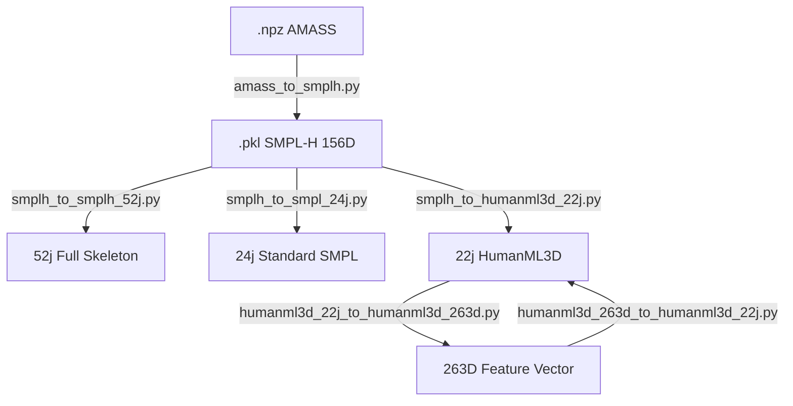

# SkeletonHub: 高精細度骨架轉換與標準化工具箱

`SkeletonHub` 是一個專為 3D 人體動力學研究設計的標準化專案，旨在解決不同數據集（如 AMASS, HumanML3D, SMPL）之間骨架定義不統一的問題。

---

## 🛠 數據轉換全景圖 (Data Flow Panorama)

本專案支持從高階參數模型 (SMPL-H) 到低階特徵向量 (263D) 的全鏈路轉換：



---

## 📐 核心技術規格 (Technical Specifications)

### 1. 物理標準化
*   **單位**：公尺 (m)。
*   **軸向**：右手中手系，Y 軸向上 (Y-up)。
*   **座標變換**：自動執行 AMASS (Z-up) ➔ Standard (Y-up) 投影。

### 2. 骨架索引定義 (Skeletal Hierarchy)
*   **22j (HumanML3D)**：對準 T2M 運動鏈，包含 Body (0-21)，不含手部。
*   **24j (Standard SMPL)**：對準標準 SMPL 拓樸。注意：本專案修正了 SMPL-H 轉換時的索引偏移（左手 22, 右手 37）。
*   **52j (SMPL-H)**：包含完整雙手各 15 個指節的精細動作。

### 3. 263D 特徵組成 (HumanML3D Standard)
| 維度區塊 | 內容描述 | 物理意義 |
| :--- | :--- | :--- |
| **0-3** | Root Metadata | 根節點 Y 軸旋轉速度、XZ 平面速度、離地高度。 |
| **4-66** | RIC (63D) | 21 個關節相對於根節點的局部座標。 |
| **67-192** | Rotation (126D)| 21 個關節的連續 6D 旋轉表示。 |
| **193-258** | Velocity (66D) | 22 個關節在局部座標系下的線速度。 |
| **259-262** | Foot Contact (4D)| 左右腳跟與腳尖的地面接觸判定。 |

---

## 📂 快速啟動
### 1. 數據探針 (Inspector)
```bash
python inspector.py path/to/your/data.npy
```
### 2. 視覺化 (Visualizer)
```bash
python visualizers/vis_smpl_joints.py data/smpl_joints/samples_24j/test.npy
```

---
## 📜 實作參考與致謝
本專案的數學邏輯參考並移植自以下優秀開源專案：
*   **HumanML3D**: [Guo et al. 2022] 提供特徵提取流水線。
*   **AMASS**: [Mahmood et al. 2019] 提供動作數據基礎。
*   **SMPL-X / SMPL-H**: [Pavlakos et al. 2019] 提供人體參數模型支持。

詳細的研究日誌請參閱：[docs/RESEARCH_LOG.md](docs/RESEARCH_LOG.md)
