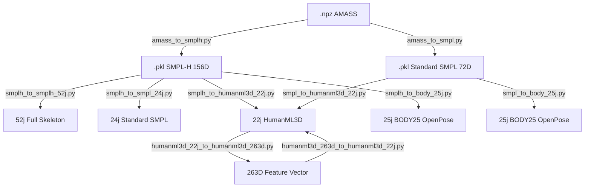

# SkeletonHub: 高精細度骨架轉換與標準化工具箱

`SkeletonHub` 是一個專為 3D 人體動力學研究設計的標準化專案，旨在解決不同數據集（如 AMASS, HumanML3D, SMPL, OpenPose BODY25）之間骨架與座標系定義不統一的問題。

---

## 🛠 數據轉換全景圖 (Data Flow Panorama)

本專案支援從高階參數模型（AMASS）到低階關節座標（22j/24j/52j/BODY25）以及特徵向量（263D）的全鏈路互轉：


```mermaid
graph TD
    AMASS[.npz AMASS] -- amass_to_smplh.py --> SMPLH_PKL[.pkl SMPL-H 156D]
    AMASS -- amass_to_smpl.py --> SMPL_PKL[.pkl Standard SMPL 72D]

    SMPLH_PKL -- smplh_to_smplh_52j.py --> JOINTS_52[52j Full Skeleton]
    SMPLH_PKL -- smplh_to_smpl_24j.py --> JOINTS_24[24j Standard SMPL]
    SMPLH_PKL -- smplh_to_humanml3d_22j.py --> JOINTS_22[22j HumanML3D]
    SMPLH_PKL -- smplh_to_body_25j.py --> BODY_25_H[25j BODY25 OpenPose]

    SMPL_PKL -- smpl_to_humanml3d_22j.py --> JOINTS_22
    SMPL_PKL -- smpl_to_body_25j.py --> BODY_25_S[25j BODY25 OpenPose]
    
    JOINTS_22 -- humanml3d_22j_to_humanml3d_263d.py --> FEAT_263[263D Feature Vector]
    FEAT_263 -- humanml3d_263d_to_humanml3d_22j.py --> JOINTS_22
```

---

## 📐 核心技術規格 (Technical Specifications)

### 1. 物理標準化 (Physical Standards)
*   **物理單位**：公尺 (meters, m)。
*   **座標系**：右手中手系，Y 軸向上 (Y-up)。
*   **座標變換**：自動將 AMASS (Z-up) ➔ Standard (Y-up) 投影。在最前端轉換層完成，後續頂點解算與關節回歸（如 BODY25）會自動繼承，無須二次變換。

### 2. 骨架索引與定義 (Skeletal Hierarchy)
*   **22j (HumanML3D)**：對準 Text-to-Motion 運動鏈，包含 Body (0-21)，不含手部。
*   **24j (Standard SMPL)**：對準標準 SMPL 拓樸。注意：本專案修正了從 SMPL-H (156D) 轉換時的索引偏移（左手 22, 右手 37）。
*   **25j (OpenPose BODY25)**：基於 `J_regressor_body25` 回歸矩陣直接從 6890 頂點（SMPL/SMPL-H）線性乘積回歸得到。
*   **52j (SMPL-H)**：包含完整雙手機關節各 15 個指節的精細動作。

### 3. 263D 特徵組成 (HumanML3D Standard)
| 維度區塊 | 內容描述 | 物理意義 |
| :--- | :--- | :--- |
| **0-3** | Root Metadata | 根節點 Y 軸旋轉速度、XZ 平面速度、離地高度。 |
| **4-66** | RIC (63D) | 21 個關節相對於根節點的局部座標。 |
| **67-192** | Rotation (126D)| 21 個關節的連續 6D 旋轉表示。 |
| **193-258** | Velocity (66D) | 22 個關節在局部座標系下的線速度。 |
| **259-262** | Foot Contact (4D)| 左右腳跟與腳尖的地面接觸判定。 |

---

## 📂 快速啟動與自動化腳本 (Pipelines)

### 1. 累計後綴歷史命名系統 (History Suffix System)
為了方便追溯數據在轉檔鏈中的每一階段，所有轉換器在不指定 `--output` 時，會自動讀取 Basename 並**追加特定後綴**，保留完整的歷史流程：
* AMASS ➔ SMPL-H ➔ BODY25: `walking_01_poses_smplh_body25.npy`
* AMASS ➔ SMPL ➔ HumanML3D: `walking_01_poses_smpl_22j.npy`

### 2. 一鍵自動視覺化開關 (`--vis`)
在調用任何 `converters/` 下的轉換器時，只要在命令列尾端加上 `--vis` 開關，程式便會在寫檔完成後自動喚起特定的 3D 渲染引擎（Pyrender / Matplotlib），直接產出動畫影片：
```bash
# 轉換並自動渲染 SMPL-H 3D Mesh
python converters/amass_to_smplh.py data/amass/samples_smpl_H_G/walking_01_poses.npz --vis

# 轉換並自動渲染 BODY25 骨架
python converters/smpl_to_body_25j.py data/smpl/smpl/walking_01_poses_smpl.pkl --vis
```

### 3. 動力學流水線指令範例

#### 管道 A：AMASS ➔ Standard SMPL ➔ BODY25 ➔ 22j
```bash
# A.1 轉為 72D SMPL 參數
python converters/amass_to_smpl.py data/amass/samples_smpl_H_G/walking_01_poses.npz

# A.2 回歸 OpenPose BODY25 關節
python converters/smpl_to_body_25j.py data/smpl/smpl/walking_01_poses_smpl.pkl

# A.3 轉換成 HumanML3D 22 關節
python converters/smpl_to_humanml3d_22j.py data/smpl/smpl/walking_01_poses_smpl.pkl
```

#### 管道 B：數據特徵提取與還原
```bash
# B.1 提取 263D 特徵向量 (用於 T2M 訓練)
python converters/humanml3d_22j_to_humanml3d_263d.py data/smpl_joints/samples_22j/walking_01_poses_smpl_22j.npy

# B.2 將 263D 還原回 22j 關節座標並自動播放視覺化影片
python converters/humanml3d_263d_to_humanml3d_22j.py data/humanml3d/samples/walking_01_poses_smpl_22j_263d.npy --vis
```

### 4. 數據探針工具 (Inspector)
```bash
python inspector.py data/body25/walking_01_poses_smpl_body25.npy
```

---

## 📦 環境建置與打包說明 (Environment Setup & Package Details)

本專案使用 `conda` 的 **`skeleton_env`** 作為執行與運算環境（Python 3.10）。

專案根目錄下已打包完整的環境設定檔：
*   **[environment.yml](file:///home/allen/SkeletonHub/environment.yml)**：Conda 統一環境建置檔。
*   **[requirements.txt](file:///home/allen/SkeletonHub/requirements.txt)**：Pip 依賴套件明細。

### 1. 核心依賴套件明細 (Key Dependencies)
*   **深度學習底座**：PyTorch 2.0.1 (CUDA 11.7)
*   **3D 圖學與人體模型**：PyTorch3D 0.7.8、SMPL-X 0.1.28
*   **3D 視覺化與渲染**：Pyrender 0.1.45 (EGL Headless 支援)、Trimesh 3.10.5、OpenCV-Python、Matplotlib
*   **資料與特徵處理**：NumPy 1.26.4、SciPy 1.7.2、Pandas 1.4.1
*   **模型配置與日誌**：Hydra-Core 1.3.2、OmegaConf 2.3.0、Loguru

### 2. 快速建立與啟動環境 (Quick Start)

#### ⚡ 管道 A：使用 Conda 描述檔一鍵還原 (推薦)
```bash
# 從 environment.yml 建立 skeleton_env
conda env create -f environment.yml

# 啟用環境
conda activate skeleton_env
```

#### 🛠 管道 B：手動建立並透過 pip 安裝
```bash
# 建立 Python 3.10 乾淨環境
conda create -n skeleton_env python=3.10 -y
conda activate skeleton_env

# 透過打包好的 requirements.txt 安裝依賴
pip install -r requirements.txt
```

### 3. Linux 伺服器無頭渲染配置 (Headless Offscreen Rendering)
專案內建的 3D 影片渲染引擎（例如 `--vis` 參數呼叫的 `MeshRenderer`）預設使用 **EGL Offscreen Rendering** 進行離線 GPU 渲染。

若您在 **Linux 遠端無 GUI 伺服器** 上執行時發生 OpenGL 錯誤，請確保伺服器已安裝以下 Mesa 系統庫：
```bash
sudo apt-get update
sudo apt-get install libegl1-mesa-dev libgl1-mesa-dev libosmesa6-dev
```

---

## 📜 實作參考與致謝 (Acknowledgments)
本專案的物理、數學與優化邏輯參考並移植自以下優秀開源專案：
*   **HumanML3D**: [Guo et al. 2022] 提供特徵提取與 RIC 還原流水線。
*   **AMASS**: [Mahmood et al. 2019] 提供動作數據基礎。
*   **SMPL-X / SMPL-H**: [Pavlakos et al. 2019] 提供人體參數模型支持。
*   **EasyMocap**: [Zhejiang University] 提供高精度回歸矩陣與 L-BFGS 擬合核心。

詳細的研究日誌請參閱：[docs/RESEARCH_LOG.md](docs/RESEARCH_LOG.md)
詳細施工進度請參閱：[docs/PROGRESS.md](docs/PROGRESS.md)
