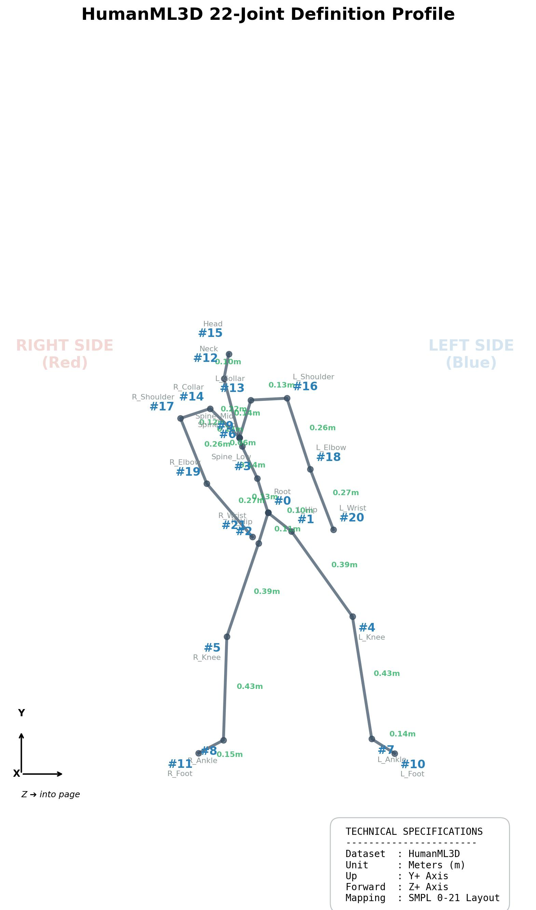

# HumanML3D Dataset Format Definition

這是本專案針對 **HumanML3D (22 Joints)** 格式的官方定義文件。

---

## 1. 骨架規範規格圖 (Skeleton Profile)
下圖展示了從真實資料集中提取的標準骨架定義，包含節點索引、關節名稱以及平均骨骼長度。

> **注意**：
> *   圖中所示為 **正面視角 (Front View)**，即角色面向相機。
> *   **紅色標註** 代表角色自身的 **右側 (Right)**。
> *   **藍色標註** 代表角色自身的 **左側 (Left)**。

---

## 2. 物理屬性規範 (Physics & Coordinate Rules)

| 屬性 | 規格 | 說明 |
| :--- | :--- | :--- |
| **長度單位** | 公尺 (Meters) | 1.0 代表 1 公尺 |
| **坐標軸 (Up)** | **Y+** | 垂直向上 |
| **坐標軸 (Forward)** | **Z+** | 角色初始朝向 |
| **坐標系統** | 右手坐標系 | 標準右手系 (Right-Handed) |
| **取樣頻率** | 20 FPS | 每秒 20 幀 |
| **特徵維度** | 263D | 包含根節點位移、相對位置、旋轉與腳底接觸 |

---

## 3. 節點地圖 (Joint Map)

| ID | 名稱 (Standard) | 所屬區域 |
| :---: | :--- | :--- |
| 0 | Root | 核心 |
| 1 | L_Hip | 下肢 (左) |
| 2 | R_Hip | 下肢 (右) |
| 3 | Spine_Low | 軀幹 |
| 4 | L_Knee | 下肢 (左) |
| 5 | R_Knee | 下肢 (右) |
| 6 | Spine_Mid | 軀幹 |
| 7 | L_Ankle | 下肢 (左) |
| 8 | R_Ankle | 下肢 (右) |
| 9 | Spine_High | 軀幹 |
| 10 | L_Foot | 下肢 (左) |
| 11 | R_Foot | 下肢 (右) |
| 12 | Neck | 頭頸 |
| 13 | L_Collar | 上肢 (左) |
| 14 | R_Collar | 上肢 (右) |
| 15 | Head | 頭頸 |
| 16 | L_Shoulder | 上肢 (左) |
| 17 | R_Shoulder | 上肢 (右) |
| 18 | L_Elbow | 上肢 (左) |
| 19 | R_Elbow | 上肢 (右) |
| 20 | L_Wrist | 上肢 (左) |
| 21 | R_Wrist | 上肢 (右) |

---

## 4. 如何使用
本資料夾下的 `.npy` 檔案通常為 263 維特徵。若要進行視覺化或座標轉換，請使用：
*   `converters/humanml3d_263d_to_joints.py`：將 263D 特徵還原為 (T, 22, 3) 坐標。
*   `visualizers/vis_humanml3d.py`：直接渲染特徵為影片。
